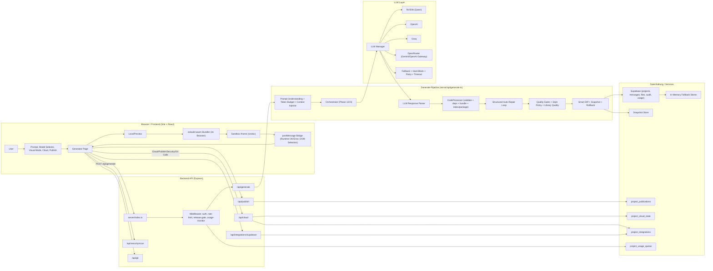
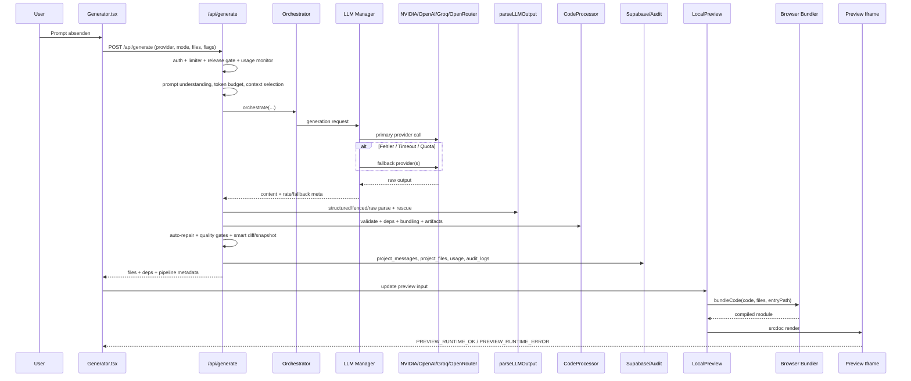
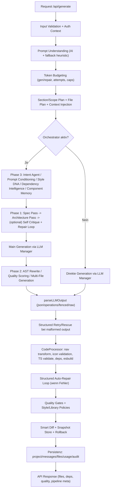
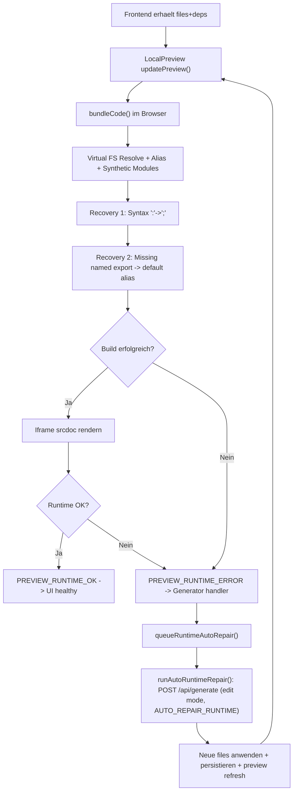
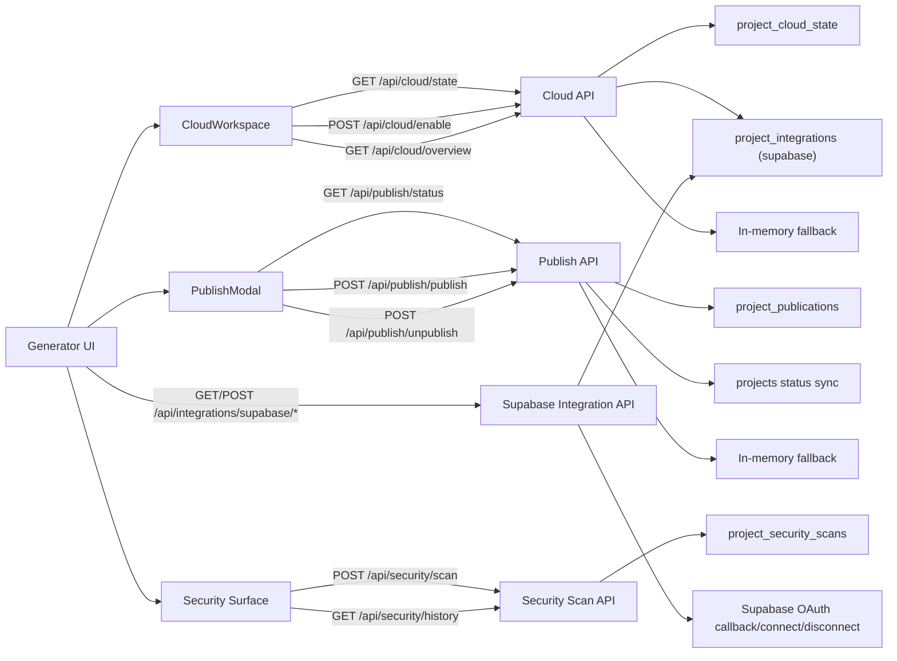
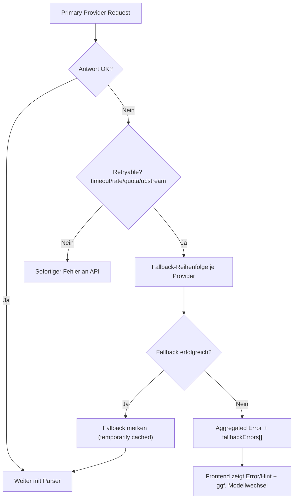

# Prompt-to-Preview Architektur (Vollstaendig)

Diese Datei beschreibt den kompletten Ablauf von der Prompt-Eingabe bis zur Darstellung im Preview, inklusive Orchestrierung, Provider-Fallbacks, Persistenz, Auto-Repair und Cloud/Publish/Security-Nebenpfaden.

## 1) Gesamt-System (Komponentenlandkarte)

## 2) Hauptfluss Prompt -> Preview (Sequenz)

## 3) Backend-Generate Pipeline (Detail)

## 4) Preview + Runtime Auto-Repair (Detail)

## 5) Cloud / Publish / Security Nebenfluesse

## 6) Provider-/Fehlerpfade (kompakt)

## 7) Was diese Architektur garantiert

- Voller End-to-End Pfad von Prompt bis Preview-Render ist abgedeckt.
- Fehlerbehandlung existiert auf drei Ebenen: Provider, Parser/Processor, Preview Runtime.
- Persistenz ist durch Supabase + In-Memory Fallback robust gemacht.
- Cloud/Publish/Security sind als eigene API-Subsysteme integriert, aber am selben Generator-UI angedockt.

